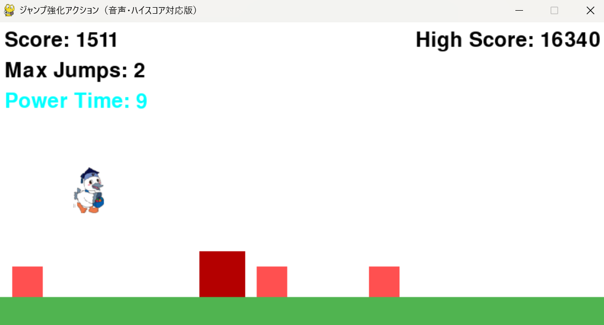

# 走れこうかとん！！！

## 
* python >= 3.10
* pygame >= 2.1

## ゲームの概要
* こうかとんを操作しながら迫りくる障害物をジャンプでよけながら走行距離を稼ぐシンプルなチャリ走風ゲームです。
* 左上のScoreが現在のスコア、Max Jumpsが現在の最大ジャンプ数、青色のパワーアップアイテムを入手したときのみに表示されるPower Timeが二段ジャンプ可能な残り時間、右上のHigh Scoreが今までのハイスコアを示しています。

## ゲームの遊び方
* ジャンプ: SPACEキーを押すとプレイヤーがジャンプします。
* 移動: 横方向への自動スクロールで、プレイヤーの操作はジャンプのみです。
* ゲームオーバー: 敵に接触するとゲームオーバーとなります。
* リスタート: ゲームオーバー画面でRキーを押すとゲームを再開できます。
## ゲームの実装
### 共通基本機能
* 背景画像と主人公キャラクターの描画

### 分担追加機能
* 効果音[担当:C0A24211]：BGMと効果音を追加
* ハイスコア[担当:C0A24211]：ハイスコアを記録し、プレイ中に表示させる機能を追加
* アイテム（コイン）[担当：C0A24111]：アイテム（コイン）を取得するとスコアが50増える機能を追加、敵とともにコインが３つ流れてくる
* スコアに応じた難易度上昇[担当：C0A24271]：スコア500以上で手前で黄色くなりジャンプする敵を追加、スコア1000以上でサイズが大きい敵を追加、スコア1500以上で敵のスピードアップ
* 上に乗るのはセーフ[担当:C0A24231]:敵の上から接触した場合、ゲームオーバーにならない機能の実装
* アイテム（二段ジャンプ）[担当：C0A24135]:アイテムを取得すると２段ジャンプが可能になる機能
* アイテム入手時の効果音の実装[担当:C0A24231]
* 敵が重なって出現するバグを修正[担当:C0A24231]
### メモ
* クラス内の変数は，すべて，「get_変数名」という名前のメソッドを介してアクセスするように設計してある
* すべてのクラスに関係する関数は，クラスの外で定義してある